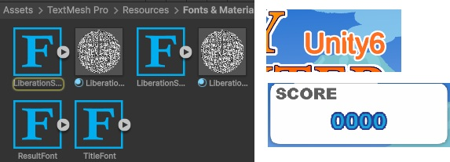

# JewelryHunter＿Unity6

[ゲームサンプル](https://likering.github.io/JewelryHunter_web/)


## 訓練校で学習する初２D作品　
* playerの動作
* アニメーションの作り方
* タグやレイヤーの使い方
など基本を学んでいます。

## 制作ポイント
### アニメーションをトランジションで作成
Playerのアニメ切り替えには各クリップを、トランジションで繋いでフラグで管理しました。
トランジションを組み込むことで、アニメ切り替えが滑らかになり
かつコーディングが効率的なものになりました。


## Itemのコーディングの効率化
Itemは列挙型のItemColorを自作して、ItemColor型の変数次第で何色が選ばれているかにより
見た目が変わるようなコーディングの工夫を行いました。


 
  ```c#
  using UnityEngine;

public enum ItemColor
{
    White,
    Blue,
    Green,
    Red
}

public class ItemData : MonoBehaviour
{
    public ItemColor colors = ItemColor.White;
    public Sprite[] itemSprites;

    public int value = 0;       // 整数値を設定できる

    void Start()
    {        
        SpriteRenderer spriteRenderer = GetComponent<SpriteRenderer>();

        switch (colors)
        {
            case ItemColor.White:
                spriteRenderer.sprite = itemSprites[0];
                break;
            case ItemColor.Blue:
                spriteRenderer.sprite = itemSprites[1];
                break;
            case ItemColor.Green:
                spriteRenderer.sprite = itemSprites[2];
                break;
            case ItemColor.Red:
                spriteRenderer.sprite = itemSprites[3];
                break;
        }
    }
}
```

## TextMeshProのデザイン切り分け
TextMeshProのデザインを細かく切り分けてデータを用意するなど工夫しました。




